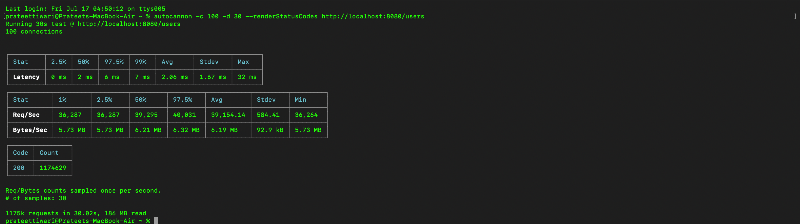

# Gateway Baseline

## Command

autocannon -c 100 -d 30 --renderStatusCodes http://localhost:8080/users

## Results

- Avg Req/Sec: 2,100
- Avg Latency: 46.74 ms
- P99: 432 ms
- 502: 2,620

## Investigation

Implemented a custom shared http.Transport.

## New Results

- Avg Req/Sec: 39,154
- Avg Latency: 2.06 ms
- P99: 7 ms
- 502: 0

## Conclusion

Explicit transport configuration significantly improved throughput and eliminated 502 responses under this benchmark.