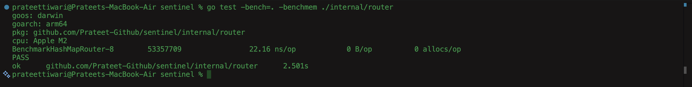

# HashMap Router Benchmark

## Machine
- Apple M2
- macOS
- Go 1.xx.x

## Command

go test -bench=. -benchmem ./internal/router

## Results

- 22.10 ns/op
- 0 B/op
- 0 allocs/op

## Screenshot

(images/hashmap-bench.png)

## Notes

Baseline implementation.